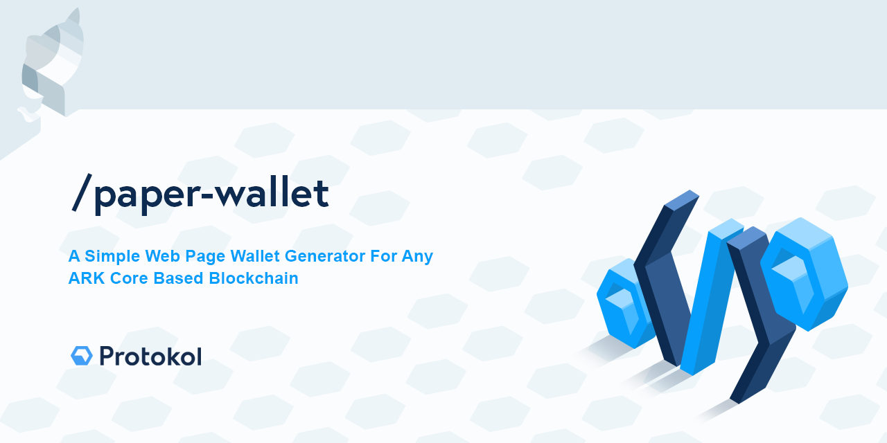

# Paper Wallet


[](https://creativecommons.org/licenses/by-nc-sa/4.0/)

## Running Locally

There are two ways you can run the Paper Wallet locally:

1. Download the latest `dist.zip` release, extract the contents and open the `index.html` file in your browser.
2. Clone the repo and run `pnpm dev` to run a local version.

## Adding Networks

By default, the Paper Wallet uses the Protokol mainnet when generating a wallet.
However, it comes bundles with multiple network options that you can switch to, making it usable on for example devnet and bridgechains.
If you run a public bridgechain, you can have your network added by creating a PR that adds the `name`, `pubkeyHash` and `WIF` to the existing list of networks.

## Using Custom Network

If the network you want to use is not listed in the dropdown, you can switch to custom networks in the modal, fill in the `pubkeyHash` and `WIF` values of the network you want to use, and press `Save` to apply it. That's it!

## Development

### Requirements

The Paper Wallet has the following requirements:

- [Node.js](https://nodejs.org/) 20 or higher
- [pnpm](https://pnpm.io)

### Commands

<details><summary>List of commands</summary>

```bash
# Install dependencies
pnpm install

# Compiles and hot-reloads for development
pnpm dev

# Compiles and minifies for production
pnpm build

# Typecheck
pnpm typecheck

# Lint the code
pnpm lint

# Run your tests
pnpm test:e2e
pnpm test:unit

# Generate release zips
pnpm task:release

# Deploy on GitHub pages
pnpm task:deploy
```

</details>

## AI Agent Skills

Company AI skills and security guardrails for coding agents come from
[protokol/protokol-ai](https://github.com/protokol/protokol-ai), distributed as
[Agent Skills](https://agentskills.io/specification).

They are **not committed** — `skills-lock.json` pins them and the `postinstall`
hook refreshes them on every install:

```json
"postinstall": "npx -y skills update -y --copy || true"
```

`update` compares each skill's GitHub tree hash against the lock and re-copies
only what changed, so a normal install is cheap. The `|| true` keeps a flaky
network from breaking `pnpm install`. A fresh clone restores exactly the pinned
skills into `.claude/skills/` (and `.agents/skills/` for other agents) — no
extra step. Both directories are gitignored.

To pull in new skills or re-seed the lock:

```bash
npx skills add protokol/protokol-ai --skill '*' -a claude-code -y --copy
```

Security guardrails (`security-dangerous-commands`, `security-git-safety`,
`security-secret-protection`, `security-exfiltration-prevention`,
`security-file-protection`, `security-database`, `security-package-install`,
`security-prompt-injection`) ship deterministic `PreToolUse` hooks. On
hook-capable agents (Claude Code, Cline, Kiro CLI) they hard-block the action;
elsewhere they are advisory instruction only.

Optional extras, installed from upstream so they stay fresh — they land in the
same lock, so `postinstall` refreshes them too:

```bash
npx skills add obra/superpowers -a claude-code   # skip the 3 protokol-core forks
npx skills add mattpocock/skills --skill handoff -a claude-code
npx skills add shadcn/improve -a claude-code      # audit -> plans for cheaper models
```

## Security

If you discover a security vulnerability within this package, please send an e-mail to info@protokol.com. All security vulnerabilities will be promptly addressed.

## License

This work is licensed under [Creative Commons Attribution-NonCommercial-ShareAlike 4.0 International License](https://creativecommons.org/licenses/by-nc-sa/4.0/), under the following terms:

#### Attribution

You must give appropriate credit, provide a link to the license, and indicate if changes were made. You may do so in any reasonable manner, but not in any way that suggests the licensor endorses you or your use.

#### NonCommercial

You may not use the material for commercial purposes. For commercial purposes please reach out to info@protokol.com.

#### ShareAlike

If you remix, transform, or build upon the material, you must distribute your contributions under the same license as the original.

#### Legal code

Read the rest of the obligatory [license legal code](https://creativecommons.org/licenses/by-nc-sa/4.0/legalcode).

[CC BY-NC-SA 4.0](LICENSE) © [Protokol](https://protokol.com)
